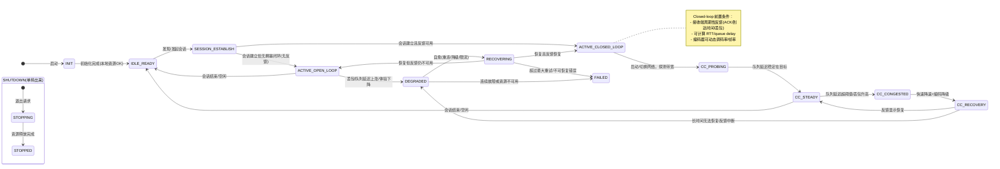

# 项目说明

平台：jetson orin  t186

环境：ROS1

代码规范：见config文件夹下的 guide.md文件，必须严格按照该规范文件进行编码

现要求对原项目进行重构，以下是一些建议说明

# 基本生命周期设计

> 融入了SCREaM版本

## 生命周期落地建议（状态/触发/责任模块）

> 目的：把“什么时候切状态、谁负责判定、依赖哪些指标”写清，避免后续实现各自理解。

| 状态 | 进入触发(示例) | 退出触发(示例) | 主要责任模块 |
|---|---|---|---|
| INIT | 进程启动 | 本地资源检查完成 | `main_node` |
| IDLE_READY | camera/encoder/udp 可用 | 发现/发起会话 | `main_node` + gRPC |
| SESSION_ESTABLISH | 收到 pair/accept 或主动请求 | UDP handshake ready -> ACTIVE_* | gRPC + `udp_stream_manager` |
| ACTIVE_OPEN_LOOP | UDP ready 但无反馈闭环 | 收到稳定反馈 -> ACTIVE_CLOSED_LOOP；或体验下降 -> DEGRADED | `udp_stream_manager` +（未来）反馈接收器 |
| ACTIVE_CLOSED_LOOP | 反馈可用 | 反馈中断 -> DEGRADED | 拥塞控制管理器（未来 SCReAM） |
| DEGRADED | 丢包/队列延迟升高/无 ACK | 自愈动作启动 -> RECOVERING；或超时失败 -> FAILED | `main_node` + udp/video（降级动作） |
| RECOVERING | 重连/降码率/降帧率/关 FEC | 恢复判定 -> ACTIVE_*；或超时失败 -> FAILED | `main_node` + gRPC + udp/video |
| FAILED | 超过最大重试/不可恢复错误 | 人工重启或进入 SHUTDOWN | `main_node` |
| SHUTDOWN/STOPPING | 退出请求 | 资源释放完成 | `main_node` |

### 默认判定指标（建议先写死，后续再参数化）

* 反馈中断：连续 `>2s` 未收到 ACK/反馈消息（按业务可调）
* 退化触发（任一满足即可进入 DEGRADED）：
  * `dropped_frames` 持续增长（例如 5s 内增长 > N）
  * UDP `EAGAIN` 丢包持续发生（例如 5s 内 > 0 且趋势上升）
  * pacing 队列长期逼近上限（`queue_max_bytes` 持续接近 100%）
* 恢复判定：连续 `>3s` 无明显丢帧且队列延迟回落到阈值内

### SCReAM/拥塞控制接入点（建议提前预留模块边界）

* 建议新增 `congestion_control_manager（CongestionControlManager）`：
  * 输入：接收端反馈（ACK/到达时间/丢包/RTT 等）
  * 输出：目标发送速率（用于 `udp.pacing.bps`）、目标编码码率/帧率（用于 `video_encoder` 动态调参）、必要时调整 FEC 策略
  * 归属：不放进 UDP 或 Video 具体模块里，避免耦合与循环依赖

### 退化/恢复动作清单（建议优先级，先可写死后参数化）

> 核心原则：优先“限流/降质量”而不是“重建大模块”；重建是最后手段。

* Level 0（轻量动作，实时生效，优先尝试）
  * 降低 `udp.pacing.bps`（先降 10%~30%）以降低 kernel tx queue 压力
  * 同步降低 `video.encoder.bitrate`（避免 encoder 继续产生过载）
  * 若业务允许：降低 `video.profile` 的 framerate（降帧率通常比频繁丢帧更可控）

* Level 1（中等动作，影响画质/恢复点，但仍不重建模块）
  * 调整 I/IDR 策略：
    * 拥塞时适当增大 I/IDR 间隔（降低峰值），或开启 intra-refresh 并保留低频 IDR
  * FEC 降级：严重拥塞时可临时关闭 FEC（例如 `udp.fec.table_id=0`），用更低冗余换取更少占用
  * 硬性控延迟：降低 `udp.pacing.queue_max_bytes`（会增加丢帧概率，但可避免延迟堆积）

* Level 2（重连/重建，最后手段）
  * UDP 重连：触发 HELLO/ACK 重新握手或重建 socket（适用于对端切网/NAT 异常）
  * Encoder 重建：适用于编码器 DQ 线程卡死、长时间无输出
  * Capture 重建：适用于 V4L2 设备异常、连续 DQBUF 失败

* 恢复策略（从 RECOVERING 返回 ACTIVE_*）
  * 恢复后先保持当前配置稳定一段时间（例如 3s~10s），再逐步上调 bitrate/pacing（每次 +5%~10%）
  * 避免震荡：恢复要“慢启动”，未来可由 SCReAM/CC 模块统一接管
# 类设计

## 命名规范（统一约定）

* 文档中模块/文件名使用 `snake_case`（例如：`udp_stream_manager`、`video_encoder`）
* 代码中的 C++ 类名使用 `PascalCase`（例如：`UdpStreamManager`、`VideoEncoder`）
* 本文如同时出现两者，将采用“`snake_case`（`PascalCase`）”的写法
* “管理类/门面类”统一用 `_manager` 后缀；协议/握手等控制面统一用 `_client`；纯算法/策略组件用 `_strategy/_encoder/_scheduler`

## main_node

* 唯一的节点类，负责整体的生命周期管理，不做任何具体业务，作为唯一入口以及与ROS交互的唯一接口

* 所有的参数，都要在main_node中读入再传入各个模块

### video 管理类

* video视频媒体链路的统一出入口，与main_node交互
* 负责媒体链路生命周期的管理，不做任何具体业务

#### video_stream_manager（VideoStreamManager，薄门面/生命周期编排）

* 对外职责：start/stop、参数读取与校验、设置编码输出回调（将 H264 帧交给 UDP/WebRTC/文件等下游）
* 对内职责：组合各子模块并管理线程，不直接承载 V4L2/NvJPEG/NvBufSurfTransform/NVENC 的细节
* 线程模型建议（贴合现有实现）：
  * `capture_thread`：只负责从 `video_v4l2_capturer` DQBUF 拿到最新帧，并执行“低延迟丢帧策略”（仅保留最新一帧）
  * `pipeline_thread`：对最新帧执行 decode/convert/encode，完成后尽快 QBUF 归还 V4L2 buffer

> 低延迟策略说明：当 pipeline 忙时，capture 侧直接丢弃旧帧并立即 requeue，保证端到端延迟可控（代价是帧率可能下降）。

#### video 数据流与 buffer 所有权（建议写清，便于后续重构落地）

* 数据流（建议保持单向、无环）：
  * `video_v4l2_capturer`(DQBUF) -> `video_decoder`(dmabuf_fd) -> `colorspace_convert`(nv12_dmabuf_fd) -> `video_encoder`(H264 bytes) -> 下游(UDP/录制/后续WebRTC)
* V4L2 buffer 所有权：
  * DQBUF 后 buffer 暂由 `video_stream_manager` 持有
  * decode/convert 完成后应尽快 QBUF 归还（避免 driver 缓冲耗尽导致抖动）
* dmabuf_fd 所有权（两级 pool 的闭环）：
  * `video_decoder` 输出的 decode dmabuf_fd 由 `colorspace_convert` 接管并在处理后归还
  * `colorspace_convert` 输出的 NV12 dmabuf_fd 由 `video_encoder` 接管
  * `video_encoder` 通过 `InputDoneCallback` 通知 `colorspace_convert` 归还 NV12 dmabuf_fd
  * pool 耗尽时优先丢帧（实时性优先），避免在 pipeline 线程阻塞

#### video_v4l2_capturer（VideoV4L2Capturer，采集源）

* 负责：V4L2 设备打开/配置（分辨率、帧率、像素格式）、STREAMON/OFF、DQBUF/QBUF
* 关键点：
  * `dequeue()` 返回的 `Frame.data` 指向 mmap buffer，调用方必须在处理完成后 `requeue()`
  * 尽量缩短 buffer 持有时间，避免驱动侧缓存耗尽导致抖动

#### video_decoder（VideoDecoder，解码器/解码缓冲池）

* 目标：把“压缩域输入”解码为原始像素面（通常是 YUV422 或 YUV420）的 DMA buffer
* 输入：MJPEG 帧 bytes + timestamp
* 输出：解码后的 `dmabuf_fd` + timestamp（像素格式/宽高等元信息可选输出）
* 资源管理：
  * 内部维护 decode dmabuf pool（external buffers），避免每帧动态分配
  * 输出 FD 的生命周期由下游接管；下游处理完必须归还（例如 `releaseFd(fd)`）
  * pool 耗尽时丢帧而非阻塞（实时链路优先）

#### colorspace_convert（ColorspaceConverter，色彩/格式转换器 + 输出缓冲池）

* 目标：将解码输出的 YUV422/YUV420 转换为 NVENC 友好的 NV12（DMABUF FD），并可选择 VIC/GPU 计算路径
* 输入：解码阶段输出的 `dmabuf_fd` + timestamp
* 输出：NV12 的 `dmabuf_fd` + timestamp，通过 callback 交给 `video_encoder`（或其他消费者）
* 资源管理：
  * 内部维护 NV12 输出 dmabuf pool（避免每帧 new/free）
  * encoder 消费完成后，通过 `InputDoneCallback` 归还 FD 到 `colorspace_convert`
  * 若输出 pool 耗尽，直接丢帧，保证低延迟

> 迁移策略：现有 `video_converter（VideoConverter）` 的职责建议拆分并分别落到 `video_decoder` 与 `colorspace_convert`；短期可保留 `video_converter` 作为兼容封装（内部组合两个新类），待调用方稳定后再移除。

#### video_encoder（VideoEncoder，硬件编码器封装）

* 输入：NV12 `dmabuf_fd` + timestamp
* 输出：H264 bitstream bytes + timestamp + keyframe 标记，通过 callback 交给下游（UDP/录制/后续 WebRTC）
* 关键点：
  * 通过 `InputDoneCallback` 通知上游归还 dmabuf（将 buffer 生命周期闭环）
  * 编码器参数（码率/GOP/IDR/低延迟项）全部参数化，由 `video_stream_manager` 统一读取并注入

#### h264_keyframe_detector（可选：关键帧检测/诊断）

* 负责：从 H264 码流检测 IDR/I-slice，用于“关键帧策略/录制落盘/网络侧 FEC 加强”等
* 现有实现映射：目前关键帧检测逻辑位于 `video_encoder` 内部（可后续抽为独立组件以减小 encoder 类体积）

#### video_recorder（VideoRecorder，落盘模块）

* 负责：将 H264 码流写入文件（异步线程写盘），支持队列限长与丢弃策略
* 建议：录制与“数据面发送”解耦；录制慢时只影响录制队列，不反压编码主链路

#### 编码输出回调约定（不单独设计成类）

* 目标：明确“编码输出送到哪里”的扩展点，但不引入额外类层级
* 形式：沿用回调即可（与当前实现一致）
  * `EncodedFrameCallback(data,size,timestamp_us,keyframe)`
  * `video_stream_manager` 对外提供 `setEncodedFrameCallback()`
* 扩展策略：当出现多路下游需求（例如 UDP + WebRTC + 录制 + 诊断）时，优先扩展为“多播回调”而不是引入接口类
  * 例如提供 `addEncodedFrameCallback()`，内部维护回调列表并顺序调用

#### 时间戳约定（不单独设计成类）

* 目标：保证 video→udp 的延迟统计与未来拥塞控制不被系统时钟跳变影响
* 约定：链路内部统一使用单调时钟域（推荐 `std::chrono::steady_clock`）的微秒时间戳
* 实现建议：采集侧若拿到的是设备/系统域时间戳，在 `video_stream_manager` 内部做一次“映射/校正/兜底”（实现细节不独立成类），对外只暴露统一后的时间戳

### gRPC 管理类

* 负责与后端、VR端的信令层交互

#### 建议补充的职责边界（避免与 UDP/Video 耦合不清）

* 会话/配对：接收 pair/system 事件，维护会话状态并通知 `main_node`
* 配置下发：将服务端配置（目标码率/分辨率/FEC 开关/目的端地址等）转成参数更新或动态接口调用
* 心跳与重连：失败重试、退化与恢复触发条件（与生命周期状态机对齐）

### UDP 管理类

* 负责整个UDP传输链路的流管理，与main_node交互
* 不做任何具体业务，负责UDP生命周期的管理

#### udp 下的其他类（按现有功能拆分，模块边界清晰，可单独替换）

> 现状问题：当前 `UdpStreamManager` 同时承担控制面(握手/保活/ACK)、数据面(分片/组包/FEC)、发送调度(pacing)、队列/丢帧策略、统计与日志等多种职责，导致类体积过大、修改耦合强。

##### 总体分层（先按控制面/数据面硬切）

* 控制面（Signaling/Handshake）：只负责 HELLO/PING/ACK 的状态机与重试，产出“数据面可发送”的 ready 信号
* 数据面（Video Data Plane）：只在 ready 后接收 H264 帧，完成分包/可选 FEC/入队/发送调度与统计

##### 建议类划分（与现有实现贴合，命名按本节规范）

* `udp_stream_manager`（`UdpStreamManager`，薄门面/生命周期编排）
  * 对外暴露：start/stop、sendH264Frame、setSessionId、setFecTableId、pacing 与队列参数等
  * 只负责组合各子模块并管理线程，不承载协议细节与算法细节

* `udp_transport`（`UdpTransport`，传输抽象，封装 socket 与参数）
  * 内部可直接复用现有 `udp_socket`（`UdpSocket`）
  * 负责：open/close、send/recv、setSendNonBlocking、setSendBufferBytes 等与系统 socket 相关的操作

* `udp_signaling_client`（`UdpSignalingClient`，控制面：握手/保活/ACK）
  * 负责：HELLO/PING 的发送节奏、ACK 接收、超时重试、ready 状态维护
  * 输出：`ready`（atomic 或回调事件）
  * 建议将当前 `signalingThreadMain + recvThreadMain` 逻辑整体收敛到该类

* `udp_video_data_plane`（`UdpVideoDataPlane`，数据面编排：帧→包→入队）
  * 负责：接收 H264 帧输入，调用 packetizer/fec 产出 datagrams，再推入队列
  * 不负责：socket 发送细节（交给 sender）、握手（交给 signaling）

##### 数据面内部组件（建议进一步拆成 4 块）

1) `h264_frame_packetizer`（`H264FramePacketizer`，分包器）
   * 输入：一帧 H264 bytes + capture_timestamp
   * 输出：source packets（header 填充 FrameId/Seq/Timestamp/FragmentIndex/TotalFragments 等）
  * 依赖：可复用现有 `udp_packet_builder`（`UdpPacketBuilder`，负责把 header+payload 序列化成 datagram）

2) FEC 相关（策略/编码/调度解耦，便于替换）
   * `fec_strategy`（`IFecStrategy` 接口）：给定 total_fragments 与 table_id，决定是否启用 FEC 以及 groups/r 等参数
     * 默认实现：`v2_fec_table_strategy`（`V2FecTableStrategy`，使用当前 JSON 表的 groups/r 映射）
   * `fec_encoder`（`IFecEncoder` 接口）：根据 source packets 计算 parity packets（只负责算，不负责穿插发送顺序）
     * 默认实现：`gf256_rs_fec_encoder`（`Gf256RsFecEncoder`，承载 gf256 与系数矩阵缓存）
   * `fec_scheduler`（`IFecScheduler` 接口）：决定 source 与 parity 的交织策略（例如你现有的按 round 交错 + parity 均匀分布）
     * 默认实现：`interleaved_fec_scheduler`（`InterleavedFecScheduler`）

3) `frame_job_queue`（`FrameJobQueue`，按帧边界的队列与丢弃策略）
   * 目标：把“队列容量限制 + 超限丢弃最老帧”的逻辑从 manager 中独立出来
   * 建议数据结构：队列里存 `FrameJob`（一帧一个 job），避免 Datagam/FrameEnd 混装带来的复杂性
     * `FrameJob`：frame_id、capture_timestamp、enc_bytes、packets、（可选）fec/统计提示信息

4) `paced_sender`（`PacedSender`，发送线程：pacing + sendto + 统计）
   * 输入：从 `frame_job_queue` pop 出 `FrameJob`
   * 内部拆分建议：
    * `packet_pacer`（`PacketPacer`）：实现发送节奏控制（virtual clock 或 token bucket），只决定“何时发”
    * `udp_datagram_sender`（`UdpDatagramSender`）：封装 `send()` 的错误处理策略（nonblocking 的 EAGAIN 丢弃、统计等），只负责“怎么发”
    * `send_stats_collector`（`SendStatsCollector`）：收集 per-frame 发送耗时/丢包/队列延迟等，输出到日志系统

##### udp 数据流与队列边界（建议写清）

* 数据流：H264 frame -> `h264_frame_packetizer` -> (optional) `fec_strategy/encoder/scheduler` -> `frame_job_queue` -> `paced_sender` -> `udp_transport`
* 队列语义：`frame_job_queue` 以“帧”为丢弃单位（超限优先丢最老帧），避免 Datagram/FrameEnd 混装带来的复杂性
* pacing 语义：`packet_pacer` 只负责“何时发”，不关心包内容；发送失败策略由 `udp_datagram_sender` 负责

##### 线程模型建议（与现状一致但更清晰）

* 控制面：1 个线程（或内部 tick），负责 HELLO/PING/ACK
* 数据面发送：1 个线程（PacedSender），从队列取 job 并发送
* 生产侧：由调用 `sendH264Frame()` 的线程执行（完成 packetize/FEC 并入队），避免额外线程

##### 拆分实施优先级（行为不变、先降复杂度）

1) 抽离 FEC 表加载/解析与系数缓存（从热路径移出）
2) 抽离 `UdpSignalingClient`（控制面独立）
3) 引入 `FrameJobQueue`（按帧 job 入队/丢帧）
4) 重构发送线程为 `PacedSender + PacketPacer + StatsCollector`（收益最大，风险最高）

### audio 管理类

* 音频管理类，待定，先不实现，保留

# 参数建议（建议可直接写入 config.yaml）

> 目标：把“哪些参数可调、默认值是什么、影响链路哪里”写清，避免后续只能翻代码。

## video 相关

* `video.profile`：`[3840,1520,30]`，统一 profile（width,height,framerate）
* `video.device`：`/dev/video0`，V4L2 采集设备路径
* `video.pixel_format`：`mjpeg`，采集像素格式（`mjpeg|mjpg|yuyv|yuy2`）
* `video.v4l2.buffer_count`：`8`，V4L2 driver mmap buffer 数量

> 说明：当前代码仍由 `video_converter（VideoConverter）` 统一实现 decode+convert，因此参数前缀仍为 `video.converter.*`。
> 后续按设计拆为 `video_decoder`/`colorspace_convert` 时，可保持参数名不变（仅内部映射），或再做一次前缀迁移。

* `video.converter.buffer_pool_size`：`12`，NV12 输出 pool 大小（越大越不易丢帧，但可能增加内存占用）
* `video.converter.compute`：`default`，转换计算设备（`default|vic|gpu`）
* `video.converter.dec_layout`：`__unset__`，解码输出 surface layout（`pitch|block`）
* `video.converter.out_layout`：`__unset__`，转换输出 surface layout（`pitch|block`）
* `video.converter.layout`：`__unset__`，legacy 参数（建议逐步废弃）

* `video.encoder.bitrate`：`20000000`，编码码率 bps
* `video.encoder.idr_interval`：`30`，I 帧间隔（GOP size，frames）
* `video.encoder.idr_interval_gops`：`1`，IDR 间隔（映射到底层 setIDRInterval，frames）
* `video.encoder.force_idr_every_n`：`0`，强制每 N 帧一个 IDR（调试用）

* `video.encoder.intra_refresh.enabled`：`false`，slice intra-refresh 开关
* `video.encoder.intra_refresh.interval_slices`：`0`，intra-refresh 的 slice 间隔
* `video.encoder.low_freq_idr.enabled`：`false`，低频 IDR（配合 intra-refresh 建议开启）
* `video.encoder.low_freq_idr.interval_sec`：`2`，低频 IDR 周期（秒）

* `video.encoder.qp_range_i_min/qp_range_i_max`：`10/40`，I 帧 QP 范围
* `video.encoder.qp_range_p_min/qp_range_p_max`：`10/40`，P 帧 QP 范围
* `video.encoder.output_plane_buffers`：`10`，encoder output plane buffers
* `video.encoder.capture_plane_buffers`：`10`，encoder capture plane buffers

* `video.encoder.max_perf_mode`：`false`，Jetson max perf
* `video.encoder.hw_preset`：`""`，Jetson preset（`ultrafast|fast|medium|slow|disable|default`）
* `video.encoder.rate_control`：`""`，码率控制（`cbr|vbr|cq|default`）
* `video.encoder.peak_bitrate`：`0`，peak bitrate（可选）
* `video.encoder.virtual_buffer_size`：`0`，VBV（越小通常越低延迟，但更易码率抖动）
* `video.encoder.num_reference_frames`：`-1`，参考帧数（低延迟通常更少）
* `video.encoder.num_b_frames`：`-1`，B 帧数（低延迟通常为 0）
* `video.encoder.insert_sps_pps_at_idr`：`-1`，是否在 IDR 插入 SPS/PPS

* `video.recording.enabled`：`false`，是否录制 H264
* `video.recording.output_dir`：`""`，录制输出目录（为空则当前工作目录）

## udp / logging 相关

* `udp_ip`：`192.168.3.2`，UDP 目的 IP
* `udp_port`：`7778`，UDP 目的端口

* `udp.fec.enabled`：`true`，FEC 开关
* `udp.fec.table_id`：`1`，FEC 表 ID（当前仅支持 1；设为 0 禁用）

* `udp.pacing.enabled`：`true`，pacing 开关
* `udp.pacing.queue_max_bytes`：`1048576`，pacing 队列最大字节数

* `udp.send.nonblocking`：`true`，非阻塞发送（EAGAIN 时丢包并统计）
* `udp.send.sndbuf_bytes`：`0`，SO_SNDBUF（0 表示不设置）

* `udp.stop_after_frames.enabled`：`false`，仅发送前 N 帧（调试用）
* `udp.stop_after_frames.max_frames`：`0`，N 的值（0 表示不限）
* `udp.header_log.max_packets`：`8`，最多打印/记录多少个 UDP header（0 表示不限制）

* `logging.file.enabled`：`false`，是否启用文件日志
* `logging.file.path`：`/tmp/teleop_robot_bridge.log`，文件日志路径
* `logging.file.topics`：`[]`，启用的 topic 列表（由代码内部映射到 bitmask）

## lifecycle / 退化恢复（建议新增参数，占位）

> 说明：当前代码未实现这些参数的读取；建议在后续引入“状态管理/拥塞控制”时一起落地。

* `lifecycle.ack_timeout_ms`：`2000`，ACK/反馈超时判定
* `lifecycle.degraded.window_ms`：`5000`，退化判定统计窗口
* `lifecycle.recover.window_ms`：`3000`，恢复判定统计窗口
* `lifecycle.recover.hold_ms`：`5000`，恢复后维持期（避免震荡）
* `lifecycle.action.step_down_pct`：`0.2`，降级时 bitrate/pacing 默认下降比例
* `lifecycle.action.step_up_pct`：`0.1`，恢复时 bitrate/pacing 默认上升比例

# 日志系统

要求给该项目构建一份完善的日志系统，每次启动后输出日志到logs文件夹下，并尽量让日志系统更加灵活、参数化

# 其他说明

* 现在还没有实现SCREaM管理，但尽量使现在的代码容易在未来接入
* 尽量将一些常用参数  参数化到config下的config.yaml中
* 这里描述的不够详细，详情请你从原项目中分析，同时考虑真正的产品常用的实现逻辑